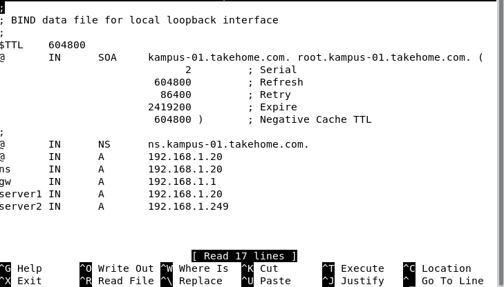
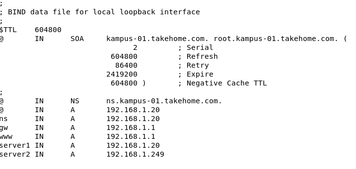
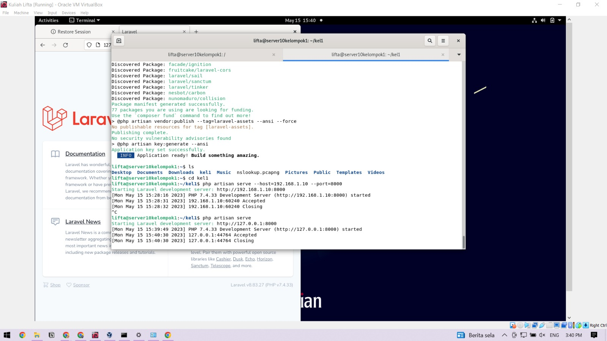
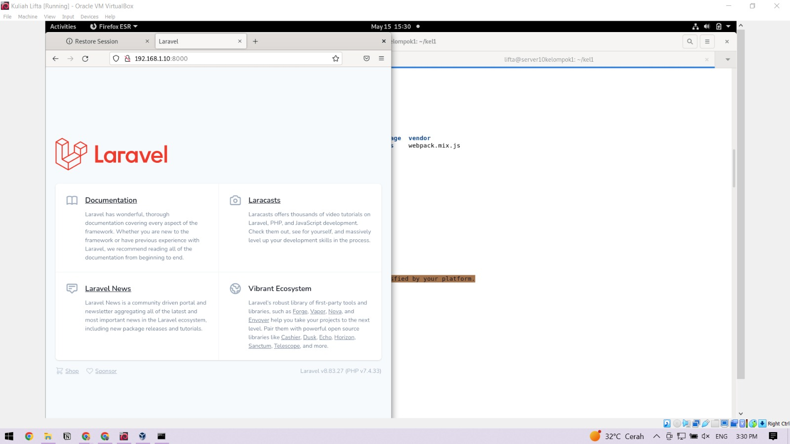
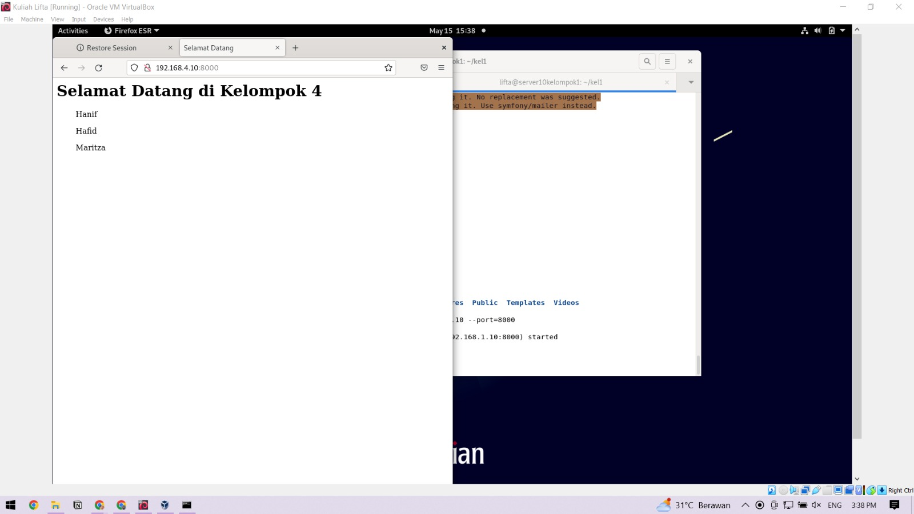

# Laravel
### Dosen Pengampu
Dr. Ferry Astika Saputra ST, M.Sc
### Disusun Oleh
Akbar Pratama Bimantoro - 3121600053<br>
Lifta Annisa Husaina - 3121600045<br>
Aditya Bagus Ferryanto - 31216000448<br>
2 D4 IT B

---

## Melanjutkan Tugas sebelumnya terkait DNS
sebelumya file db.kampus-01.takehome.com yang ada pada folder ```/etc/bind``` pindahkan ke dalam ```/var/cache/bind```



kemudian pada file ```named.conf.local``` pada direktori ```/eetc/bind``` tambahkan ```allow transfer { ip address;}; ``` tambahkan seperti gambar dibawah


- Penambahan ```allow-transfer {10.252.108.10;};``` pada konfigurasi zona tersebut digunakan untuk memberi izin transfer zona ke alamat IP ```10.252.108.10``` yang memungkinkan server DNS lain untuk menyalin catatan zona tersebut, fungsinya untuk melakukan sinkronisasi zona antara server DNS yang berbeda. Agar server DNS lain yang memiliki ```IP 10.252.108.10 ``` dapat menyalin catatan di zona "kampus-06.takehome.com" dari server DNS BIND ini.

pada file ```/var/cache/bind/db.kampus.01.takehome.com``` tambahkan www untuk dapat client mengakses website laravelnya, ip yang dimasukkan adalah ip dari virtual-box yang terinstall laravel



## Instalasi Laravel pada client Web Server

- install package-package yang diperlukan untuk install laravel
```sh
sudo apt install -y php php-common php-cli php-gd php-mysqlnd php-curl php-intl php-mbstring php-bcmath php-xml php-zip
```

- install curl
```sh
sudo apt install -y curl
```

- install composer dengan perintah
```sh
curl -sS https://getcomposer.org/installer | sudo php -- -- install-dir=/usr/bin --filename=composer
```

- kemudian buat project baru dengan perintah
```sh
composer create-project laravel/laravel kel1
```

- jalankan laravel dengan perintah
```sh
php artisan serve --host={ip-vm} --port=8000
```


menjalankan php artisan harus masuk ke dalam direktori kel1 yang dibuat tadi



- setelah itu kita cek apakah laravel pada client lain dapat diakses

