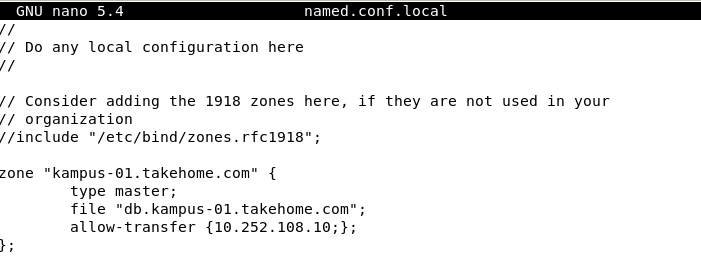

# Laravel & DNS Slave
### Dosen Pengampu
Dr. Ferry Astika Saputra ST, M.Sc
### Disusun Oleh
Lifta Annisa Husaina - 3121600045<br>
Akbar Pratama Bimantoro - 3121600053<br>
Aditya Bagus Ferryanto - 3121600048<br>
2 D4 IT B

---

## Konfigurasi DNS Master & Slave
sebelumya file db.kampus-01.takehome.com yang ada pada folder ```/etc/bind``` pindahkan ke dalam ```/var/cache/bind```


kemudian pada file ```named.conf.local``` pada direktori ```/eetc/bind``` tambahkan ```allow transfer { ip address;}; ``` tambahkan seperti gambar dibawah



- Penambahan ```allow-transfer {10.252.108.10;};``` pada konfigurasi zona tersebut digunakan untuk memberi izin transfer zona ke alamat IP ```10.252.108.10``` yang memungkinkan server DNS lain untuk menyalin catatan zona tersebut, fungsinya untuk melakukan sinkronisasi zona antara server DNS yang berbeda. Agar server DNS lain yang memiliki ```IP 10.252.108.10 ``` dapat menyalin catatan di zona "kampus-06.takehome.com" dari server DNS BIND ini.

pada file ```/var/cache/bind/db.kampus.01.takehome.com``` tambahkan www untuk dapat client mengakses website laravelnya, ip yang dimasukkan adalah ip dari virtual-box yang terinstall laravel


---
## Instalasi Laravel di Linux (pada Server)
Berikut adalah step-step instalasi Laravel
#### Instalasi Composer
- Untuk melakukan instalasi composer dapat dilakukan dengan menggunakan perintha:
    ```
    sudo apt install composer
    ```
    
#### Install Laravel
- Install Laravel dapat dilakukan dengan perintah
    ```
    composer global require "laravel/installer"
    ```
    
### Mengglobalkan Direktori
Pastikan direktori ~/.composer/vendor/bin/ menjadi global di sistem. Jika belum, maka bisa lakukan step berikut:
- Buka file ~/.bashrc
    ```
    nano ~/.bashrc
    ```
    
- Lalu pada baris terakhir, tambahkan dua baris berikut:
    ```
    PATH=$PATH:$HOME/.config/composer/vendor/bin
    export PATH
    ```
    
### Membuat Project Laravel
- Untuk membuat project baru pada laravel dapat dilakukan dengan menggunakan composer dengan perintah 
    ```
    composer create-project --prefer-dist laravel/laravel blog
    ```
- Untuk membuat project baru pada laravel dapat dilakukan dengan menggunkan command
    ```
    laravel new namaproject
    ```
    
- Apabila pada saat pembuatan project laravel disini terdapat 1 problem yaitu phpunit. Oleh karena itu terlebih dahulu install phpunit dengan perintah
    ```
    sudo apt install phpunit
    ```
    
    
### Testing Laravel
Jika proses di atas lancar tanpa error. Maka laravel sudah terinstall dengan baik. Berikutnya adalah melakukan testing pada project laravel yang telah dibuat
- Masuk ke direktori project.
    ```
    cd Kelompok1/
    ```
- Lalu jalankan perintah berikut:
    ```
    php artisan serve
    ```
    
- Apabila terdapat eror dan warning seperti gambar diatas maka update composer dengan perintah:
    ```
    composer update
    ```
    
- Lalu jalankan perintah berikut:
    ```
    php artisan serve
    ```
    
- Maka laravel akan berjalan menggunakan default server php, pada port 8000. Sehingga ketika kita membuka http://localhost:8000, kita akan mendapati halaman seperti berikut
  
  
---
## Instalasi Laravel pada client Web Server
- install package-package yang diperlukan untuk install laravel
```sh
sudo apt install -y php php-common php-cli php-gd php-mysqlnd php-curl php-intl php-mbstring php-bcmath php-xml php-zip
```

- install curl
```sh
sudo apt install -y curl
```

- install composer dengan perintah
```sh
curl -sS https://getcomposer.org/installer | sudo php -- -- install-dir=/usr/bin --filename=composer
```

- kemudian buat project baru dengan perintah
```sh
composer create-project laravel/laravel kel1
```

- jalankan laravel dengan perintah
```sh
php artisan serve --host={ip-vm} --port=8000
```


menjalankan php artisan harus masuk ke dalam direktori kel1 yang dibuat tadi


- setelah itu kita cek apakah laravel pada client lain dapat diakses


