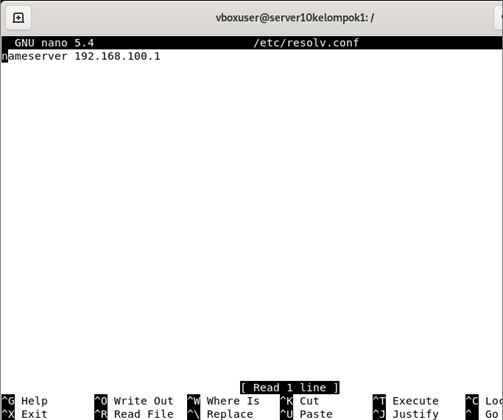

# LAPORAN RESMI WORSKHOP ADMINISTRASI JARINGAN

## Domain Name Service (DNS)

### Dosen Pengampu
Dr. Ferry Astika Saputra ST, M.Sc

### Disusun Oleh
Akbar Pratama Bimantoro - 3121600053<br>
Lifta Annisa Husaina - 3121600045<br>
Aditya Bagus Ferryanto - 31216000448<br>
2 D4 IT B

### Domain Name Service (DNS)
Domain Name Service (DNS) adalah layanan Internet yang memetakan alamat IP dan nama domain yang memenuhi syarat (FQDN) satu sama lain. Dengan cara ini, DNS mengurangi kebutuhan untuk mengingat alamat IP. Komputer yang menjalankan DNS disebut name servers. Ubuntu dilengkapi dengan BIND (Berkley Internet Naming Daemon), program yang paling umum digunakan untuk mengelola name servers di Linux.

## Overview

File konfigurasi DNS disimpan di direktori `/etc/bind`. File konfigurasi utama adalah `/etc/ bind/named.conf`, yang dalam tata letak yang disediakan oleh paket menyertakan berkas-berkas berikut:

- ```/etc/bind/named.conf.options```: opsi DNS global
- ```/etc/bind/named.conf.local```: untuk zona User
- ```/etc/bind/named.conf.default-zones```: zona default seperti localhost.

## Atur Penamaan Hosts

jika pada VM penamaan host belum sesaui bisa mengatur dengan perintah ```sudo hostnamectl set-hostname server10kelompok1.takehome.com```

kemudian edit file ```/etc/hosts``` tambahkan hostsnamenya

## Instalasi

buat terlebih dahulu server di VM sesuaikan ip dengan jaringan yang terhubung dan jangan lupa untuk megubah network pada VM menjadi Bridge


untuk mengaktifkan konfigurasi baru, mulai ulang server DNS. dari terminat dengan perintah berikut ```sudo apt install bind9 bind9utils bind9-doc dnsutils```


jalankan perintah ``` sudo systemctl1 restart named``` untuk memulai ulang layanan Bind dan perintah ```sudo systemctl status named``` untuk periksa dan verifikasi layanan Bind


kemudian jalankan perintah ```sudo nano /etc/bind/named.conf.options``` ubah pada bagain forwarders


## Menyiapkan Zona
edit file named.local dengan perintah ```sudo nano /etc/bind/named.conf.local```


kemudian pindahkan file db.local ke db.kampus-01.takehome.com


jika sudah ubah isi dari file db.kampus-01.takehome.com

<br>


kemudian pada file konfigurasi reverse zone akan memeindahkan isi dari file dengan perintah 

<br>
<br>


## Testing

Langkah pertama dalam menguji BIND9 adalah menambahkan Alamat IP nameserver ke host resolver. Nameserver utama harus dikonfigurasi seperti halnya host lain untuk memeriksa ulang berbagai hal. Buka DNS client untuk mengetahui detail tentang cara menambahkan alamat nameserver ke network client. Edit nameserver dan parameter untuk domain pada file ```/etc/resolv.conf```



Terdapat banyak cara untuk melakukan testing, pada kali ini kelompok kami menggunakan metode ping untuk mengetahui apakah konfigurasi sudah berhasil atau belum. Command yang diperlukan:

```ping www.example.com```<br>

screnshoot test di server VM<br>


Testing di PC Clint<br>


## Problem Solving
jika terdapat ```wired unmanaged``` pada jaringan di VM lakukan konfigurasi pada file ```/etc/NetworkManager/NetworkManager. conf``` dan ubah pada bagian manage menjadi true, setalah itu lakukan restart dengan perintah ```systemctl restart NetworkManager```


